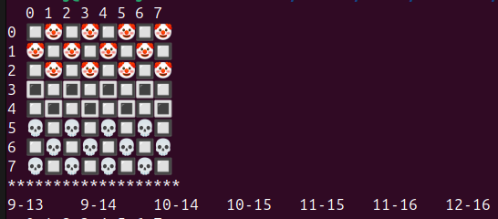
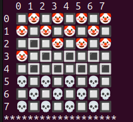
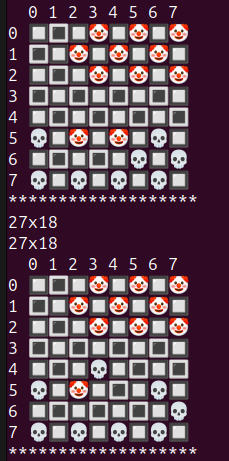
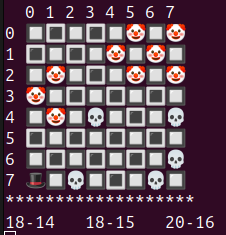

# cheekersPAMSI

This is a checkers game with a bot that uses the **minimax algorithm** with **alpha-beta pruning**.  
The project was developed for the *Algorithms and Methods of Artificial Intelligence* course at Wrocław University of Science and Technology.

---

## Features

- **Two modes of play**:
  - **Local GUI** – playable in the Linux terminal with ASCII graphics.  
  - **NET mode** – created for a university bot tournament.  

- **AI opponent (Elmo bot)**:  
  - Based on the minimax algorithm with alpha-beta pruning.  
  - Designed to prioritize keeping pieces on the edges of the board (reducing capture risk).  
  - Always takes opportunities to promote pawns to queens.  
  - With alpha-beta pruning, the algorithm can evaluate positions up to 8 moves ahead within reasonable response times.  

---

## Example Gameplay

**Game start** – Elmo is playing white(Clowns) so he starts.  
Below the board, all possible moves are displayed in *Portable Draughts Notation (PDN)*.  

  

  

**First move** – Elmo moves his piece to the side of the board, protecting the flank.  

  

  

**Forced capture** – in some situations, the player is forced to make a specific move.  
Here, the player must capture Elmo’s pawn.  

  

  

**Promotion** – Elmo advances to the edge of the board and promotes his piece to a queen. Now you are playing against Clowns lead by Capitalist  

  

  

---

## Technologies

- **C** – core implementation of the game and algorithms  
- **Minimax algorithm with alpha-beta pruning** – decision-making for the AI    
- **Linux terminal / ASCII graphics** – local gameplay interface  
- **Networking (sockets)** – implementation of NET mode for tournaments  
